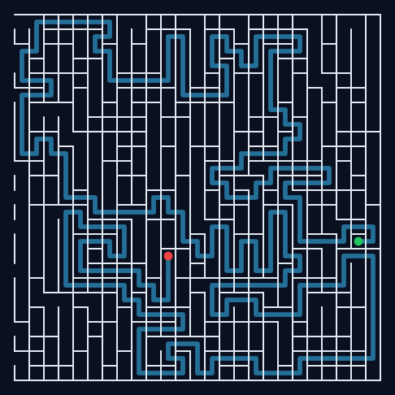

# hard-maze-maker — 世界一難しい迷路

人間が迷路を解くときの定番戦略を **体系的に無効化** して「難しさ」を最大化する迷路ジェネレータです。
**ブラウザだけ**で動きます — [`index.html`](index.html) を開くだけ。ビルド不要・依存ゼロ・サーバー不要の単一ファイルで、
生成・プレイ・画像書き出しまで全部ブラウザ内（JavaScript）で完結します。

**▶ 遊ぶ / 印刷する: https://u-masao.github.io/hard-maze-maker/**



## なにが「難しい」のか

普通の迷路は、次のどれかの戦略でわりと簡単に解けてしまいます。この迷路は
それを一つずつ潰しにいきます。

| 定番の攻略法 | 無効化する仕組み |
| --- | --- |
| **壁伝い法（右手/左手法）** | 行き止まりを繋いで **ループ（braid）** を作り、単純連結グラフを崩す。壁を辿ると同じ場所をぐるぐる回り続ける。 |
| **行き止まり潰し法** | 同じ braid によりループができるため、行き止まりを塗り潰しても道が閉じない。 |
| **なんとなく最短で進む直感** | recursive backtracker で通路を長く蛇行させ、**グラフ直径の両端**を入口・出口に置いて最短解を最長化。 |
| **一発運ゲー** | 候補を複数生成し、**難易度スコア最大の一枚を選抜**。 |

## 遊びかた

[`index.html`](index.html) をブラウザで開くだけ。

- **移動**: 矢印キー / `WASD` / `hjkl` / 画面下のパッド / スワイプ
- **サイズ**: 15×15 〜 **201×201（無間）**。大きいほど解が長く難しくなる（201×201 は最短解が 1 万数千歩）。大サイズは生成時間を約2秒以内に収めるため候補数を自動調整
- **意地悪さ**: ループ量（既定は **0＝完全迷路**）。0 は最短解が最長になり歯ごたえも最高。ループを増やすほど近道ができて最短解はむしろ短くなる傾向があるので、じっくり解くなら 0 がおすすめ
- **選抜数**: 何枚生成して最難の一枚を選ぶか
- **ヒント**: 最短解を表示（ズル）／タイム・歩数・効率を計測
- **🖨 印刷 / PDF**: 下記「印刷して遊ぶ」参照
- **PNG表示**: 迷路を PNG 画像だけの別タブで開く（ブラウザ標準機能で保存・拡大・印刷できる）
- **SVG保存 / PNG保存**: 表示中の迷路を画像ファイルとして書き出し（ヒント表示中は解つき）

## 印刷して遊ぶ 🖨

`🖨 印刷 / PDF` ボタン（またはブラウザの印刷 `Ctrl/⌘+P`）で、鉛筆で解く紙用に整形します。

- **白地・黒壁**でインク代を節約（画面は暗いテーマのまま、印刷だけ白黒）
- 入口 **S** / 出口 **G** を丸囲み文字で表示（白黒印刷でも判別できる）
- **1 枚目＝問題、2 枚目＝解答** の 2 ページ構成（解答は自動で別ページ）
- 「PDF に保存」を選べばそのまま PDF 化できる
- **SVG保存 / PNG保存も白背景**で書き出すので、印刷・共有向き

## 難易度スコア（探索基準）

候補を複数生成し、次のスコアが最大の一枚を選抜します。狙いは
**「大局的に紙面を大きく動き、局所的に単純な動きがない」解経路**です。

- `最短解` — 最短解の長さ（長いほど難しい）
- **大局的な広がり `spread`** — 解経路セルの**回転半径**（重心からの散らばり）を対角長で正規化。
  高いほど紙面の隅々まで大きく移動する解になる。
- **局所的な複雑さ `tortuosity`** — 解経路の曲がり密度（曲がり回数 / 手数）。高いほど直進が少ない。
- **直線ペナルティ `maxRun`** — 解経路の最長直線。長い直線＝単純な動きなので減点。
- `分岐点` — 次数 3 以上のセル数（迷いやすさ）
- `ループ` — 独立ループ数（`edges − cells + 1`）。近道を作って解を縮めがちなので重みは控えめ。

```
score = solution_len
      + 0.4·decisions
      + 0.3·loops
      + 3.0·spread·solution_len      # 大局: 紙面を大きく動く
      + 1.5·tortuosity·solution_len  # 局所: よく曲がる(単純でない)
      − 2.0·maxRun                   # 局所: 長い直線を減点
```

## 仕組み（生成アルゴリズム）

すべて [`index.html`](index.html) 内の JavaScript で実装しています。

1. **recursive backtracker** で完全迷路（穴なし・ループなし）を掘る。深さ優先で
   掘るため通路が長く蛇行し、解が伸びやすい。
2. **braid** で行き止まりを確率的に隣へ接続してループを作る。これで壁伝い法・
   行き止まり潰し法が破綻する。
3. **BFS を 3 回** 回してグラフ直径を求め、その両端を入口・出口に設定して最短解を最長化。
4. 1〜3 を候補数だけ繰り返し、難易度スコア最大の迷路を選抜。

決定論的 PRNG（mulberry32）を使っているので、同じシードからは同じ迷路が再現できます。

## ライセンス

[MIT](LICENSE)
